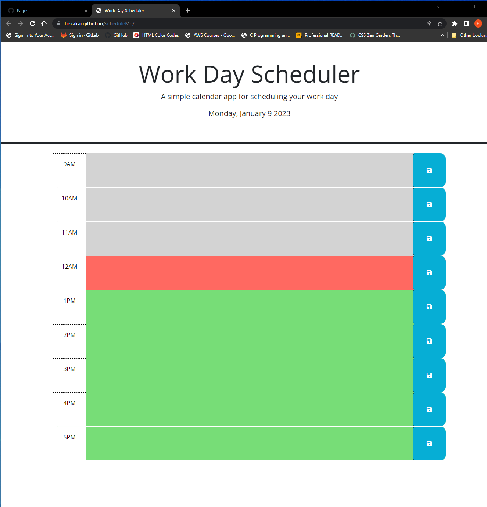

## Work Day Scheduler
This site is a single day scheduler intedend to allow the user to quickly and easily schedule out their day.  Each block is 1 hour with a color coded background based on whether that block is past , present or future.

### Instructions
#### Add an event
Click on on the text field to the right of the time slot.  Enter the event name and any other relevant info and click the blue "Save" icon to the right.  NOTE: Refreshing the page without saving will lead to a loss of your data

#### Reset
To clear the event simply delete the text and re-save.

### GitHub Repo
The full repo is located at: https://github.com/Hezakai/scheduleMe

### Live Page
You can view the live page at: https://hezakai.github.io/scheduleMe/

### Screenshot
